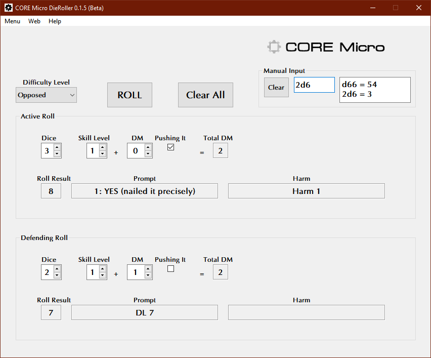

**CORE Micro Dieroller**
========================

**CORE Micro Dieroller** is a Windows program for calculating die rolls for CORE Micro RPG v3.0.

Notes
-----

**CORE Micro Dieroller** is being tested on Windows 10.

What's New in 0.1.0?
--------------------

**Pushing It** causes harm.

Requirements
------------

* **Windows 10**

* **Python 3.9**
   
  **CORE Micro Dieroller** was written using the C implementation of Python
  version 3.9. Also known as CPython.
   
* **PyQt5 5.15.4**

  PyQt5 is the framework used for displaying the Window GUI and buttons, etc.
   

Warning
-------

**CORE Micro Dieroller** will not work with **Python 2.7-**.

Not Using Python?
-----------------

You can always run the .EXE version for Windows 10 if you don't have the Python language installed.

.. |ss| raw:: html

    <strike>

.. |se| raw:: html

    </strike>

Things To-Do
------------

| Add more dice roll types.
| Cheat codes.
|ss|

| Start on a To-Do.

|se|

**Known History**

* v0.0.1b

  **Gradiated** dice rolls can be made.

* v0.0.0b

  Just a mere thought.

The CORE Micro Edition RPG was written by Tod Foley.
Copyright 2022, As If Productions.
https://www.drivethrurpg.com/product/323467/CORE-Micro

Contact
-------
Questions? Please contact shawndriscoll@hotmail.com
